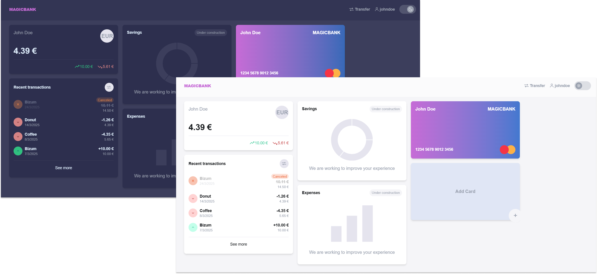
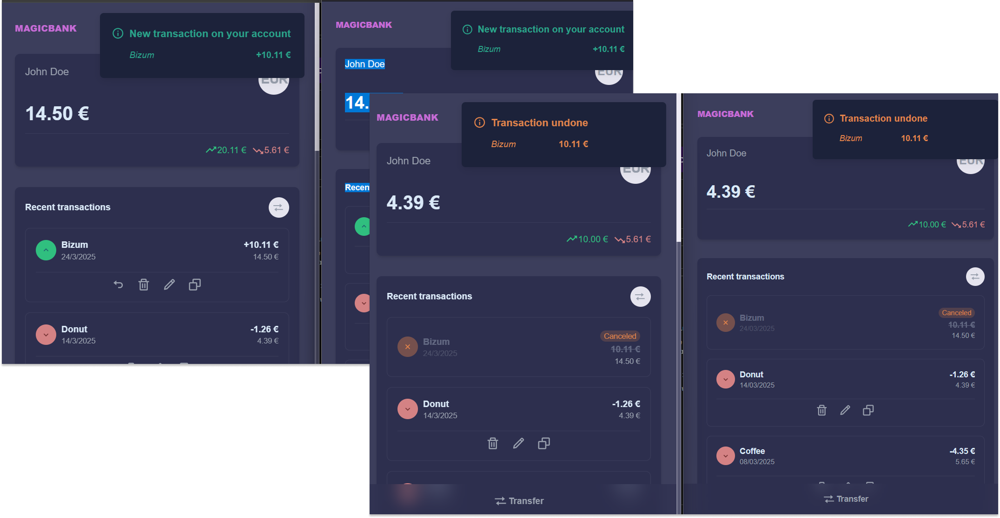

# Magic Bank 🏦🏧✨

---
➜ [Design in progress in Figma](https://www.figma.com/design/TkhEV41wN9rf4U8OvBwHuy/MagicBank-Design)  

---  

    

---  

➜ [Demo](https://bank-app-lake-eight.vercel.app/)  

---  
## REALTIME NOTIFICATIONS 🔔

  
   
---  

➜ [Backend repo](https://github.com/abigailojeda/bankapi)
  
---  
## PROJECT SETTINGS ⚙️    

➜ npm install  

You need to create a .env file for configuration:
```javascript
VITE_SERVER_URL
VITE_WS_URL
```

## TESTING 🧾👌

This project uses Vitest

### Running Tests

To run all tests, execute:

```bash
npm run test
```

## CI/CD 🚀

This project uses **GitHub Actions** for continuous integration and **Vercel** for continuous deployment. The workflow is defined in [`.github/workflows/deploy.yml`](./.github/workflows/deploy.yml) and is triggered on every push to the `dev` branch. Here’s how it works:

1. **Install Dependencies**  
   The workflow checks out the repository and installs all necessary dependencies via `npm install`.

2. **Run Tests**  
   Before building, it runs the tests using Jest (`npm run test`). If any test fails, the process stops and the deployment does not proceed.

3. **Build the Project**  
   If the tests pass, the workflow executes the build script (`npm run build`), which compiles TypeScript and bundles the app with Vite.

4. **Deploy to Vercel**  
   Finally, it deploys the built project to Vercel 
   - Deployment credentials (like `VERCEL_TOKEN`, `VERCEL_ORG_ID`, and `VERCEL_PROJECT_ID`) are stored as **GitHub repository secrets**.

## DEPENDENCIES 📚

### Toastify

[Documentation](https://fkhadra.github.io/react-toastify/introduction/)

### Apollo

[Documentation](https://www.apollographql.com/docs/react)

### Papaparse  

[Documentation](https://www.papaparse.com/docs)
